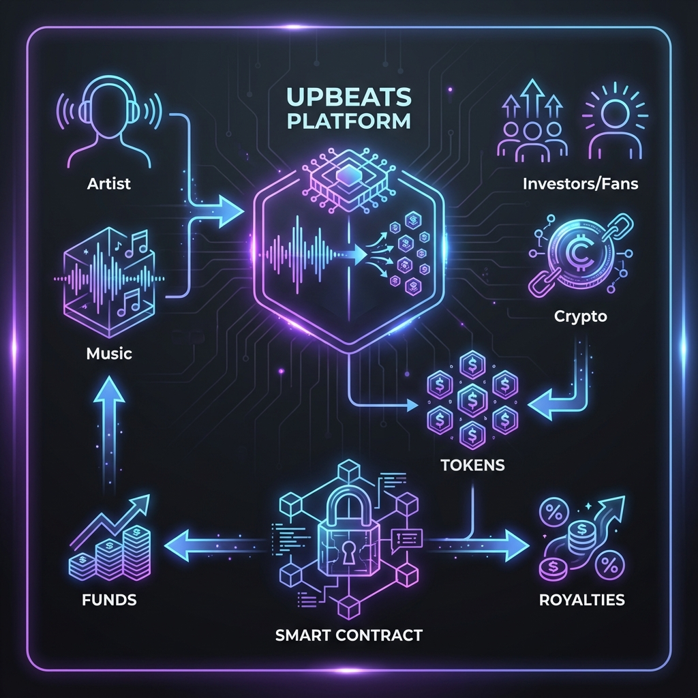

# Upbeats - The Future of Music Investment

## Executive Summary
**Upbeats** is a decentralized music investment platform that bridges the gap between independent artists and their fans. By leveraging blockchain technology, Upbeats allows artists to **tokenize their master recordings**, turning songs into investable digital assets. 

Artists get instant funding for their projects without signing away their creative control to traditional labels. Fans and investors can buy shares (tokens) of their favorite songs, earning a portion of the streaming royalties as the music succeeds. Upbeats democratizes the music industry, creating a symbiotic ecosystem where artists and fans grow together.

## Platform Flow

1.  **Artist** uploads music and legal documentation to Upbeats.
2.  **Smart Contracts** tokenize the asset into fractional ERC20 tokens.
3.  **Investors/Fans** purchase these tokens using cryptocurrency.
4.  **Automatic Distribution**: Funds go directly to the artist for production/marketing.
5.  **Royalties**: As the song generates revenue, smart contracts distribute royalties back to token holders.

## Key Features

### 1. Music Tokenization (Initial Song Offering)
*   Artists can mint ERC20 tokens representing ownership shares of their tracks.
*   Customizable parameters: Percentage of rights to sell, total valuation, and fundraising goals.
*   Secure legal binding via embedded metadata and terms.

### 2. Sync Catalog Marketplace
*   A premium marketplace for licensing master recordings for film, TV, and ads.
*   **Direct Licensing**: Buyers can purchase "Perpetual" licenses instantly via smart contracts.
*   **Transparent Pricing**: Clear, upfront costs for different usage types (Commercial, Film, etc.).

### 3. DeFi Lending for Artists
*   **Collateralized Loans**: Artists can use their future streaming revenue or unsold tokens as collateral.
*   **Instant Liquidity**: Get access to capital without selling permanent equity.
*   **Algorithmic Risk Assessment**: Borrowing limits based on historical streaming data.

### 4. Fan Engagement & Governance
*   Token holders gain access to exclusive perks (VIP tickets, meet & greets).
*   **DAO Voting**: Fans can vote on key decisions, such as which singles to release next or tour locations.

## Business Model

Upbeats operates on a sustainable transaction-based model:
*   **Tokenization Fee**: A small percentage (e.g., 2-5%) of the funds raised during the Initial Song Offering.
*   **Marketplace Commission**: A transaction fee on secondary market trades and Sync Catalog license purchases.
*   **Lending Interest**: Interest gathered from DeFi loans provided to artists.

## Challenges & Solutions

| Challenge | Solution |
| :--- | :--- |
| **Liquidity** | Selling niche music tokens can be slow. Upbeats implements **Automated Market Makers (AMMs)** (future roadmap) to ensure constant liquidity for trading tokens. |
| **Copyright Verification** | Preventing fraud is critical. We use a rigorous **KYC/KYB** process and manual verification of ownership documents before allowing tokenization. |
| **Regulatory Compliance** | Securities laws vary globally. Our token structure is designed to be compliant, focusing on revenue sharing rights rather than equity in a company. |
| **User Onboarding** | Crypto can be confusing. We provide a **seamless UI** that abstracts wallet complexity, offering familiar "Web2-style" experiences (like the simple purchase modal). |

---

## Technical Stack
*   **Frontend**: Next.js 16 (Turbopack), React 19, TailwindCSS, Framer Motion.
*   **Smart Contracts**: Solidity (ERC20, Factory Pattern), OpenZeppelin.
*   **Blockchain**: Story Aeneid Testnet.

## Deployed Contracts

| Network | Contract Name | Address |
| :--- | :--- | :--- |
| **Story Aeneid Testnet** | MusicPlatform | `0x857a7a0929DDbFc9433aFEa3EF103a04B4dA2e2A` |

## Getting Started

1.  **Install Dependencies**: `npm install`
2.  **Run Development Server**: `npm run dev`
3.  **Build for Production**: `npm run build`
